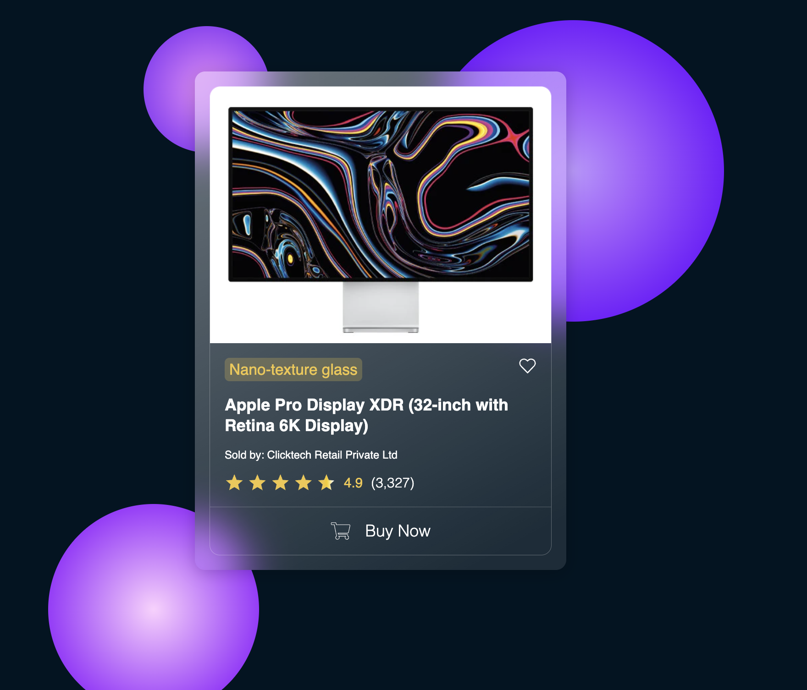

# Glassmorphic E-commerce Product Card

A sleek, modern **glassmorphic product card UI** built with HTML and CSS.  
The card features a frosted glass effect, glowing background orbs, and elegant shadows.  
It is designed to showcase product images, titles, sellers, ratings, and a CTA button in a premium way.  

---

## 🚀 Features
- Glassmorphic card design with transparency and blur
- Product image, title, and seller info
- Customer ratings and review count
- Wishlist icon and "Buy Now" CTA button
- Responsive and mobile-friendly
- Background glowing circles for depth

---

## 📸 Preview


---

## 📂 Project Structure
├── index.html # Main HTML file
├── style.css # Styling for the card
├── assets/ # Folder containing images/icons
│ ├── Apple Pro Display XDR.webp
│ ├── Star Rating.svg
│ ├── wishlist-icon.svg
│ └── Preview.png # UI preview screenshot


---

## 🔧 How to Use / Update

1. Clone or download this repository:
   ```bash
   git clone https://github.com/your-username/glassmorphic-card.git
   cd glassmorphic-card

2. Open index.html in your browser.

3. To update the product image, replace the file inside assets/:


👉 Change the file path and name to your new image, e.g.:


4. Update product details inside index.html:

Product name inside .product-title

Seller name inside .product-merchant-info

Rating values inside .averageCustomerReviews

🛠️ Tech Stack

HTML5

CSS3 (Flexbox, Glassmorphism)

📌 License

This project is open source  
.


 